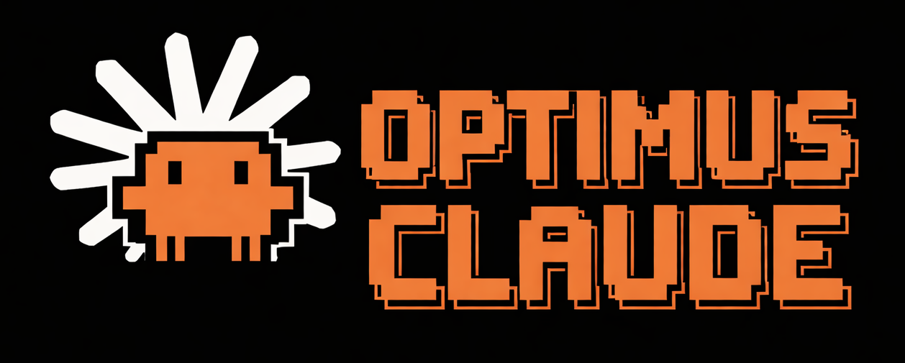

<div align="center">
  
</div>

<p align="center">
  
  
  
  
</p>

**A Claude Code plugin that sets up your project for effective AI-assisted development** — optimized CLAUDE.md files, effective coding guidelines, formatter hooks, quality agents, TDD and test coverage, all tailored to your actual codebase.

*Use it regularly and your project stays clean, consistent, tested, and well-documented — exactly the conditions where Claude Code performs at its prime.*

### Highlights

- **Consistency by design** — Every skill enforces your project's naming conventions, patterns, and architecture
- **No surprise behavior** — Install and keep using Claude Code exactly as before. Skills only run when you call them
- **Safe by default** — Skills confirm before acting, warn about risks, and respect your autonomy
- **Team force multiplier** — All output goes into `.claude/` and travels with git — teammates get consistent behavior even without the plugin installed
- **Auto-formatting on every edit** — Consistent code means less context noise — [fewer re-prompts and more accurate generation](https://code.claude.com/docs/en/best-practices)
- **Persistent quality agents** — code-simplifier and test-guardian enforce your guidelines continuously, not just when you run a skill

## Quick Start

### Install

Run these commands inside Claude Code:

```shell
/plugin marketplace add https://github.com/oprogramadorreal/optimus-claude.git
/plugin install optimus@optimus-claude
```

> Having trouble? See [Troubleshooting](#troubleshooting).

### Run

Start a new Claude Code session and type `/optimus:init` in any project directory. See [Skills](#skills) for the full list.

## Why This Plugin?

What makes a good developer productive also makes Claude Code productive: **clean code, good tests, and clear docs.**

Research backs this up: AI tools introduce [30%+ more defects](https://arxiv.org/abs/2601.02200) on poorly maintained code, and LLM performance [degrades up to 85%](https://arxiv.org/abs/2510.05381) as context length grows. Clean, DRY code with meaningful names keeps context lean and gives the LLM better semantic signals. The [2025 DORA report](https://cloud.google.com/discover/how-test-driven-development-amplifies-ai-success) puts it simply: AI amplifies existing practices, good or bad.

Another key point: [providing LLMs with tests alongside tasks consistently improves code generation](https://arxiv.org/abs/2402.13521). Tests enable self-correction. Anthropic's [#1 best practice](https://code.claude.com/docs/en/best-practices) for Claude Code reflects this: "make the AI self-verifying". Unit tests and TDD are the purest way to achieve it.

AI assistants also tend toward [sycophancy](https://blog.scielo.org/en/2026/03/13/sycophancy-in-ai-the-risk-of-complacency/) — validating ideas without critical pushback. A [2025 METR trial](https://metr.org/blog/2025-07-10-early-2025-ai-experienced-os-dev-study/) found developers using AI were [19% slower yet believed they were faster](https://arxiv.org/abs/2507.09089). This plugin counters that: every skill enforces project-defined standards as the source of truth, a shared [verification protocol](skills/init/references/verification-protocol.md) requires evidence before any completion claim and challenges assumptions before committing to an approach, code review runs independent duplicate guideline agents and verifies each finding against the actual code, and TDD ensures tests define what is correct instead of relying on the AI's confidence.

## How It Works

Every skill operates on the same shared foundation: **your project's coding guidelines** and a **verification protocol** that demands evidence over confidence.

`/optimus:init` analyzes your codebase and generates constraint docs — coding guidelines, CLAUDE.md, quality agents, formatter hooks, and test infrastructure (framework, coverage tooling, testing docs) — into your `.claude/` directory. From that point on, every optimus skill loads those guidelines, and skills that make completion claims apply the verification protocol as a gate before reporting.

`/optimus:code-review` doesn't run a generic review — its agents check *your* naming conventions, *your* architectural patterns, and *your* DRY principles alongside bugs and security. `/optimus:tdd` applies them during the Refactor step. `/optimus:refactor` uses them as its quality lens. `/optimus:unit-test` follows them for test naming and structure.

Every skill is also conservative by default — `/optimus:unit-test` never refactors source code, `/optimus:verify` runs in an isolated sandbox and never pushes to remote, and `/optimus:commit` warns about secret files before proceeding.

The result: consistent patterns, meaningful names, and lean context across every operation — exactly the signals that keep Claude Code accurate and productive.

## Design Principles

**Explicit invocation** — Skills never auto-trigger. Claude Code's default behavior is never altered unless you explicitly call a skill.

**Project-scoped output** — Everything is written into the project's `.claude/` directory and travels with the repo via git — any teammate gets identical behavior, even without the plugin installed. Keep the plugin installed for daily skills like TDD, commit, and code-review.

**Session-start awareness** — A lightweight hook runs on every session start, resume, clear, and compact to check project state (init status, test infrastructure, quality agents, git state). Fully configured projects produce zero output — no context waste.

## Skills

### Core

| Skill | Description |
|-------|-------------|
| [`/optimus:init`](skills/init/README.md) | Project setup — CLAUDE.md, coding guidelines, formatter hooks, code-simplifier & test-guardian agents, test infrastructure (framework, coverage tooling, testing docs). Detects empty directories and offers new-project scaffolding via official stack tooling before setup. Monorepos, multi-repo workspaces, intelligent audit on re-run (template files always refreshed, plugin version tracked in `.claude/.optimus-version` to detect template improvements across updates). Best-effort fallback for unsupported stacks via web search. |
| [`/optimus:unit-test`](skills/unit-test/README.md) | Fills test coverage gaps — discovers gaps, writes convention-following tests. Never refactors source. *Requires init (which sets up test infrastructure).* |
| [`/optimus:tdd`](skills/tdd/README.md) | Test-driven Red-Green-Refactor — feature branch, per-behavior commits, parallel agent quality gate, PR/MR. The [most effective discipline](https://code.claude.com/docs/en/best-practices) for reliable AI-assisted code. *Requires init.* |
| [`/optimus:refactor`](skills/refactor/README.md) | Guideline compliance + testability refactoring with 4 parallel agents — duplication, pattern inconsistency, testability barriers, architectural drift. Prioritized plan (capped at 8), test-verified. `deep` mode for iterative refactoring (default 5, up to 10 iterations). *Run init first (recommended).* |
| [`/optimus:code-review`](skills/code-review/README.md) | Pre-merge review with up to 6 parallel agents — bugs, security, guideline compliance, code-simplifier, test-guardian. Change-intent awareness via git history. `deep` mode for iterative auto-fix until clean (max 5 iterations). GitHub & GitLab. *Run init first (recommended).* |
| [`/optimus:verify`](skills/verify/README.md) | Feature branch verification in an isolated sandbox — extracts/generates a test plan from the PR and branch diff, runs automated checks, launches up to 4 parallel agents for functional verification (tests, integration, mock projects, code tracing). Never pushes to remote. *Run init first (recommended).* |

### Utility

| Skill | Description |
|-------|-------------|
| [`/optimus:branch`](skills/branch/README.md) | Switches local changes to a new branch with a meaningful name — analyzes conversation context and git diffs to derive the branch type and name following conventional naming. Never commits or pushes. Multi-repo aware. |
| [`/optimus:worktree`](skills/worktree/README.md) | Creates a git worktree for isolated parallel development — new branch in a separate directory with project setup and test baseline. Enables multiple Claude Code sessions on different tasks simultaneously. VSCode 1.103+ native integration. Multi-repo aware. |
| [`/optimus:dev-setup`](skills/dev-setup/README.md) | Ensures the project README has comprehensive, accurate "how to run in dev mode" instructions — detects tech stack, external services (docker-compose), environment config, and generates step-by-step setup sections. Audits existing instructions against actual project state. Works standalone or after init. |
| [`/optimus:pr`](skills/pr/README.md) | Creates or updates PR/MR with [Conventional PR](skills/pr/references/pr-template.md) format — structured summary, changes, rationale, test plan. Offers CLI installation. Shared template used by TDD. |
| [`/optimus:permissions`](skills/permissions/README.md) | Branch protection (feature branches work freely; protected branches require PRs), precious unversioned file safety (`.env`, certificates, databases), and auto-approved routine tool calls. Allow/deny rules + PreToolUse hook. Especially useful on native Windows where OS-level sandboxing is unavailable. |
| [`/optimus:commit`](skills/commit/README.md) | Stages, commits, and optionally pushes with a [conventional commit](https://www.conventionalcommits.org/) message. Confirms before committing. On protected branches, offers to create a feature branch automatically. Multi-repo aware. |
| [`/optimus:commit-message`](skills/commit-message/README.md) | [Conventional commit](https://www.conventionalcommits.org/) suggestions from local git changes. Splits multi-concern diffs. Multi-repo aware. Read-only — preview only. |
| [`/optimus:reset`](skills/reset/README.md) | Removes files installed by `/optimus:init` and `/optimus:permissions`. Compares each file against plugin templates and classifies as unmodified, likely generated, or user-modified. Always asks before deleting. Git-tracked files are noted as recoverable. Tests are never touched. Monorepo and multi-repo aware. Use for clean reinstall or to stop using optimus. |

## Recommended Workflow

1. **Safety guardrails** — `/optimus:permissions` for branch protection, precious file safety, and streamlined tool permissions
2. **Initial setup** — `/optimus:init` to generate project context and set up test infrastructure (audits and updates if already present)
3. **Test coverage** — `/optimus:unit-test` to write tests and improve coverage
4. **Code quality** — `/optimus:refactor` for full codebase refactoring against your coding guidelines and testability

**During development** — `/optimus:branch` to move work to a properly named branch, `/optimus:tdd` to build features test-first, `/optimus:worktree` for parallel isolated workspaces, `/optimus:commit` for conventional commits (or `/optimus:commit-message` to preview the message without committing).

**Before merging** — `/optimus:pr` to create or update pull requests, `/optimus:verify` to prove the feature branch works in an isolated sandbox, `/optimus:code-review` for pre-merge code quality review.

**After major changes** — re-run `/optimus:init` to audit and refresh guidelines.

**New to a codebase?** — `/optimus:dev-setup` ensures the README has accurate development setup instructions for onboarding.

**Removing optimus** — `/optimus:reset` to remove optimus-generated files from the project (for clean reinstall or to stop using optimus).

## Complementary Tools

optimus-claude is designed to work alongside official tools, not replace them. Use Anthropic's official [code-review](https://github.com/anthropics/claude-code/tree/main/plugins/code-review) plugin for post-push PR review, [claude-md-management](https://claude.com/plugins/claude-md-management) for CLAUDE.md scoring and revision, the builtin `/simplify` for per-change cleanup (complemented by `/optimus:refactor` for project-wide restructuring), and Claude Code's [built-in sandboxing](https://code.claude.com/docs/en/sandboxing) or [Docker containers](https://www.docker.com/blog/docker-sandboxes-run-claude-code-and-other-coding-agents-unsupervised-but-safely/) for fully autonomous agent execution with OS-level isolation.

## Troubleshooting

### Windows: SSL certificate error during install

If you see `SSL certificate OpenSSL verify result: unable to get local issuer certificate` when running `/plugin marketplace add`, Git for Windows is using an outdated OpenSSL CA bundle. Fix it by switching to the native Windows certificate store:

```shell
git config --global http.sslBackend schannel
```

Then retry the install command.

## Contributing

See [CONTRIBUTING.md](CONTRIBUTING.md) for project structure, skill anatomy, feature branch testing, and local development setup.

## Research & References

- [Claude Code Best Practices](https://code.claude.com/docs/en/best-practices) — Anthropic: testing as #1 practice, compact CLAUDE.md, deterministic hooks, custom subagents
- [How TDD Amplifies AI Success](https://cloud.google.com/discover/how-test-driven-development-amplifies-ai-success) — DORA Report 2025: AI adoption increases delivery instability; TDD provides the control system
- [Code for Machines, Not Just Humans](https://arxiv.org/abs/2601.02200) — Borg et al. 2026: AI defect risk increases 30%+ on unhealthy code
- [AI-Friendly Code Design](https://www.thoughtworks.com/radar/techniques/ai-friendly-code-design) — Thoughtworks Tech Radar Vol. 32: "good software design for humans also benefits AI"
- [Context Length Alone Hurts LLM Performance](https://arxiv.org/abs/2510.05381) — Du et al. 2025: 13.9%–85% degradation as input length increases
- [Writing a Good CLAUDE.md](https://www.humanlayer.dev/blog/writing-a-good-claude-md) — HumanLayer: WHAT/WHY/HOW structure, progressive disclosure, <60 lines
- [Test-Driven Development for Code Generation](https://arxiv.org/abs/2402.13521) — Mathews et al. 2024: providing LLMs with tests alongside problem statements consistently improves code generation outcomes
- [AI Makes Engineering Discipline More Important](https://codemanship.wordpress.com/2026/02/26/71-of-developers-and-engineering-leaders-believe-ai-makes-engineering-discipline-more-important/) — Codemanship 2026: 71% of developers say disciplined practices like TDD become more important with AI, not less
- [AI Developer Productivity: Perception vs. Reality](https://arxiv.org/abs/2507.09089) — METR 2025: experienced developers were 19% slower with AI but believed they were 24% faster — a striking confirmation bias gap
- [Sycophancy in AI: The Risk of Complacency](https://blog.scielo.org/en/2026/03/13/sycophancy-in-ai-the-risk-of-complacency/) — SciELO 2026: AI sycophancy increases short-term productivity but reduces quality of collaborative work
- [LLM-Powered Devil's Advocate for Decision-Making](https://dl.acm.org/doi/fullHtml/10.1145/3640543.3645199) — IUI 2024: multi-agent debate reduces social influence bias and fosters balanced evaluation
