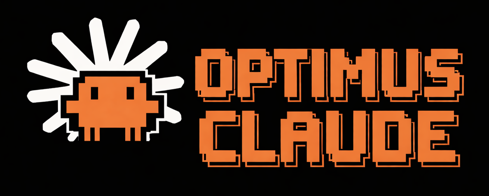

<div align="center">
  
</div>

<p align="center">
  
  
  
  
  
</p>

**A plugin that sets up your project for effective AI-assisted engineering in Claude Code, with [experimental OpenAI Codex support](#using-with-openai-codex).**

**The problem:** AI amplifies whatever it finds. Messy code leads to messier AI-generated code, which becomes the context for even worse output, a cycle that compounds faster than any human could create technical debt.

**The solution:** Optimus generates project instructions, coding guidelines, and test infrastructure from your actual codebase, then holds every quality pass to those standards: code review, refactoring, TDD, and a resumable deep-fix loop. Used regularly, your project stays clean, consistent, tested, and documented: the context your coding agent needs to work well.

**The philosophy:** It's all about perfecting context. The codebase, prompts, tests, docs, commit messages, and PR descriptions all add up to shape how well your coding agent performs. Every skill is lean by design: 3.0 cut the plugin's own instruction footprint by more than half so the skills spend your context window on your project, not on themselves.

## Quick Start

You need Git for installation and Bash to run the plugin. On native Windows, install [Git for Windows](https://git-scm.com/download/win) first.

### Claude Code

Run these commands inside Claude Code:

```shell
/plugin marketplace add https://github.com/oprogramadorreal/optimus-claude.git
/plugin install optimus@optimus-claude
```

Start a new session in your project directory and run `/optimus:init`.

### OpenAI Codex (experimental)

Use a plugin-capable Codex CLI. From a terminal:

```shell
codex plugin marketplace add oprogramadorreal/optimus-claude
codex plugin add optimus@optimus-claude
```

In Codex, open `/hooks` to **review and trust the session-start hook**, then start a new session in your project directory and run `$optimus:init`. Installation alone does not trust hooks. If the agent has no `[optimus] Running under Codex` session context, follow [Troubleshooting](#codex-skills-or-compatibility-context-missing).

**Command notation:** examples below use `/optimus:<skill>` for Claude Code. In Codex, use `$optimus:<skill>` with the same arguments for supported workflows. `permissions`, `dream`, and formatter installation are Claude-only; see the [Codex support matrix](#support-matrix) for other limits.

## How It Works

`init` reads your codebase and sets up:

- **Project guidance:** conventions, constraints, and `CLAUDE.md` instructions under `.claude/`, with package-specific guidance in monorepos.
- **Test infrastructure:** commands and conventions that the testing and review skills use to verify changes.
- **Host integration:** optional formatter hooks in Claude Code, or `AGENTS.md` pointers to the shared guidance in Codex.

Skills never run on their own; you invoke them. Generated project docs travel with your repository and remain useful without the plugin. Re-run `init` after major project changes to keep them accurate.

Optimus works alongside Claude Code's built-in tools rather than replacing them. Use Anthropic's official [code-review](https://github.com/anthropics/claude-code/tree/main/plugins/code-review) plugin for post-push PR review and `/simplify` for per-change cleanup; `refactor` restructures against your project guidelines. `/goal` works until a condition holds within one session; `deep` is the resumable fix loop, with a fresh subagent per pass, test bisection, and state that survives across sessions.

## Skills

Open a skill's documentation for examples, options, and prerequisites. Run `init` before using the quality skills; `tdd` needs working tests, and `deep` needs a configured test command.

### Core

| Skill | Use it to… |
|-------|------------|
| [`/optimus:init`](skills/init/README.md) | Set up project guidance and test infrastructure, scaffold an empty project, or refresh an existing setup. |
| [`/optimus:brainstorm`](skills/brainstorm/README.md) | Explore design options and write a spec for implementation; use `scaffold` for a new product's planning docs. |
| [`/optimus:jira`](skills/jira/README.md) | Turn a Jira issue into a task with acceptance criteria and codebase context. Requires a compatible Jira MCP server. |
| [`/optimus:tdd`](skills/tdd/README.md) | Implement a task or spec through Red-Green-Refactor cycles, with commits per behavior and a final push. |
| [`/optimus:unit-test`](skills/unit-test/README.md) | Find coverage gaps and add tests that follow project conventions, without refactoring source code. |
| [`/optimus:refactor`](skills/refactor/README.md) | Improve code against project guidelines, with optional `testability` or `guidelines` focus. |
| [`/optimus:code-review`](skills/code-review/README.md) | Review local changes or a PR/MR for bugs, security issues, and guideline compliance. |
| [`/optimus:deep`](skills/deep/README.md) | Repeat review, refactoring, or coverage passes with fixes, tests, and progress you can resume across sessions. |
| [`/optimus:paper-init`](skills/paper-init/README.md) | Prepare a paper's sources, implementation spec, and evidence-based reproduction criteria before writing code. |
| [`/optimus:gauntlet`](skills/gauntlet/README.md) | Pursue an ambitious goal through builder/critic iterations against a concrete quality bar, until it passes or you stop. |

### Utility

| Skill | Use it to… |
|-------|------------|
| [`/optimus:commit`](skills/commit/README.md) | Stage and commit with an optional push; use `suggest` for a message only or `branch` to move local changes to a new branch. |
| [`/optimus:pr`](skills/pr/README.md) | Create or update a GitHub PR or GitLab MR with intent, scope, and a test plan. |
| [`/optimus:worktree`](skills/worktree/README.md) | Create an isolated Git worktree with project setup and a test baseline. |
| [`/optimus:handoff`](skills/handoff/README.md) | Save enough context for a fresh agent to resume the work. |
| [`/optimus:how-to-run`](skills/how-to-run/README.md) | Generate or refresh a `HOW-TO-RUN.md` for local setup and development. |
| [`/optimus:permissions`](skills/permissions/README.md) | **Claude Code only:** configure branch protection, file safeguards, and routine tool permissions. |
| [`/optimus:prompt`](skills/prompt/README.md) | Turn an idea into a copy-ready prompt for an AI tool. |
| [`/optimus:reset`](skills/reset/README.md) | Remove selected Optimus project artifacts; use `permissions` to remove only the permissions setup while keeping init. Preserves tests and does not uninstall the plugin. |
| [`/optimus:dream`](skills/dream/README.md) | **Claude Code only:** review and consolidate stale auto-memory, with confirmation before deletion. |

## Recommended Workflow

1. **Set up:** run `init`. In Claude Code, optionally run `permissions` first; in Codex, configure its sandbox and approval policy.
2. **Build:** use `tdd "description"` for a clear task, `brainstorm` when design decisions are needed, or `jira PROJ-123` for tracked work.
3. **Improve:** use `unit-test` to fill coverage gaps and `refactor` to improve existing code.
4. **Ship:** run `commit` → `pr` in the implementation conversation, then `code-review` in a fresh conversation. This carries the reasons for the change into the review. `tdd` already commits and pushes, so follow it with `pr` → review.

For longer work, `deep review`, `deep refactor`, and `deep coverage` repeat those passes automatically. Codex orchestration remains experimental; check its [support limits](#support-matrix) before unattended use.

**Maintenance:** re-run `init` after major changes, use `how-to-run` for setup guidance, and `reset` to remove generated project files. The [reset documentation](skills/reset/README.md) also covers uninstalling the plugin.

## Using with OpenAI Codex

Claude Code is the primary host. Codex support is experimental: shared skills use the same project guidance, but some host features are unavailable. Follow the [Codex Quick Start](#openai-codex-experimental) to install and initialize.

### Supported hosts and versions

These are recorded checks as of **2026-09-09**, not minimum required versions or proof that every workflow works. Use a release of your host that supports plugins; see [Claude Code](https://code.claude.com/docs/en/plugins) and [Codex plugin availability](https://learn.chatgpt.com/docs/plugins).

| Host | Validation status |
|------|-------------------|
| Claude Code, native Windows CLI | Primary host. 2.1.263 and 2.1.266 loaded the plugin; 2.1.266 passed `commit suggest` and Python `init` smoke checks on the 3.12.0 candidate. |
| Codex, native Windows CLI/app-server | Experimental. 0.153.4 passed installation, skill discovery, and launcher checks through plugin 3.12.1; this does not validate all skill workflows. |
| Codex desktop | Full skill workflows and updates remain unverified. |
| macOS/Linux CLI, including WSL | Not exercised in the recorded audit. |
| Codex IDE extension | Plugins are not supported in this surface. |
| Remote/cloud sessions | Not exercised in the recorded audit. |

Validation procedures and remaining checks are in [CONTRIBUTING.md](CONTRIBUTING.md#codex-smoke-test-local).

### Support matrix

All Codex workflows remain experimental. **Portable** means no known host-specific dependency in the core instructions, not a completed end-to-end test. Agent execution and available parallelism still need verification.

| Skill or feature | Codex status and limits |
|------------------|-------------------------|
| `commit`, `pr`, `handoff`, `worktree`, `how-to-run`, `paper-init`, `code-review`, `refactor`, `unit-test`, `tdd`, `reset` | Portable. Follow each skill's setup, tool, and test prerequisites. |
| `init` | Partial: creates shared docs, tests, and `AGENTS.md` pointers; preserves existing hooks/settings and skips formatter installation. |
| `brainstorm`, `jira`, `prompt` | Partial: Claude plan-mode handoffs need manual adaptation. Jira needs a compatible MCP server configured in Codex; bundled setup is Claude-only. |
| `deep` | Experimental orchestration: multiple iterations, nested agents, resume, and headless execution need further testing. |
| `gauntlet` | Experimental orchestration: use the in-session lead-agent path. Claude's `/effort` → ultracode prerequisite does not apply. |
| `permissions`, `dream` | Unsupported. Use Codex's own sandbox, approval policy, and memory controls. |
| Formatter hooks | Unsupported. Use editor formatting or pre-commit hooks. |
| Standalone `code-simplifier` / `test-guardian` plugin agents | Unsupported. Use the `refactor` / `unit-test` workflows. |

Claude's `/goal` and `/workflows` handoffs do not apply in Codex. If you use `AGENTS.override.md`, add the project-guidance pointer there yourself: it takes precedence over `AGENTS.md`, and Optimus manages only `AGENTS.md`.

### Headless runs

After installation, hook trust, project trust, and initialization, this is an **experimental** Bash/PowerShell example:

```shell
codex exec --model gpt-6-astra --sandbox workspace-write '$optimus:deep review --yes'
```

Preconfigure filesystem, Git, network, and subagent permissions: headless runs cannot obtain fresh interactive approvals. `--yes` answers Optimus confirmations only. Deep uses Git snapshots and checkpoint commits; `--no-commit` disables checkpoints but still requires snapshots. See [Codex non-interactive execution](https://learn.chatgpt.com/docs/non-interactive-mode).

On Windows, complete [sandbox setup](https://learn.chatgpt.com/docs/windows/windows-sandbox) too; hook trust does not configure it. Where available, `--approve-for-me` enables automatic permission review in place of `--sandbox workspace-write`; the flags cannot be combined. Verify effective permissions before a long run.

## Troubleshooting

### Codex: skills or compatibility context missing

Check that `optimus` is installed and enabled in `/plugins`, trust its session-start hook in `/hooks`, and start a fresh session. Hook changes in an update can require renewed trust. Use `$optimus:<skill>` mentions.

Bash must be available. On Windows, use Git for Windows or point `CLAUDE_CODE_GIT_BASH_PATH` at a native `bash.exe`. Avoid `$` or backticks in the plugin installation path; spaces are supported.

### Windows: SSL certificate error during install

If `/plugin marketplace add` reports `unable to get local issuer certificate`, switch Git for Windows to the native Windows certificate store, then retry:

```shell
git config --global http.sslBackend schannel
```

## Contributing

See [CONTRIBUTING.md](CONTRIBUTING.md) for development setup, testing, and feature-branch installation.

## Acknowledgements

- `/optimus:prompt` adapts prompt engineering techniques from [prompt-master](https://github.com/nidhinjs/prompt-master) by [@nidhinjs](https://github.com/nidhinjs).
- `/optimus:gauntlet` implements the [Gauntlet Loop](https://somethingbig.ai/gauntlet-loop) method by Matt Shumer.
